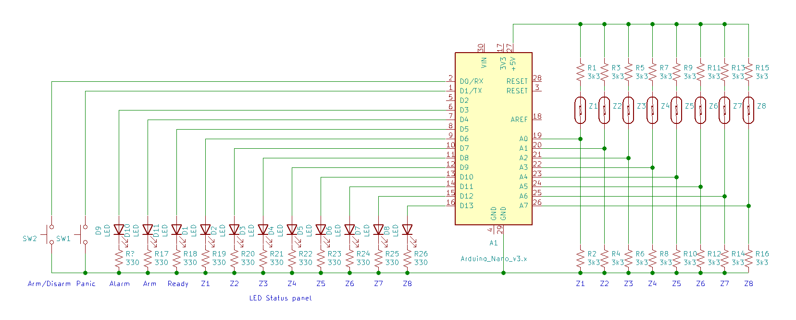
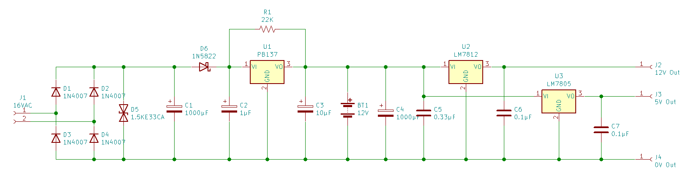

# William's Alarm

## 8 Zone Alarm Panel

* a simple 8 zone alarm.
* Typically triggered by remote
* 8 monitored zones
* Panic zone
* Output siren trigger is timed
* No by-pass
* No entry/exit delay

## Battery Charger and Power Supply

* 12V Lead Acid battery charger
* 12V regulated output
* 5V regulated output